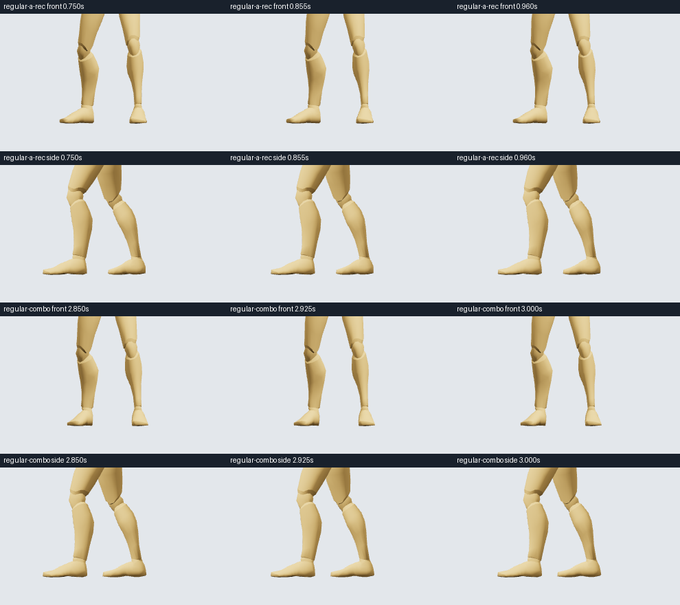

# Contact reviews and seam policies

Studio now stores measured and visually reviewed evidence separately from immutable source facts. The initial pilot below is historical; see [SWORD_PILOT.md](SWORD_PILOT.md) for the completed review and current policies. Both CLI and MCP expose the same three new operations. The sidebar shows current contact reviews and inspected connection policies; stale evidence is retained for audit but excluded from active manifests and new receipts.

## Initial recorded pilot (historical)

Reviewed on 2026-10-04 using exact source renders at interval start/middle/end in Front and Side cameras, plus the Studio viewer. Evidence includes action revisions/hashes and camera-projected frame records in `authoring/reviews/sword/frames/frames.json`. This is sampled LLM visual review, not continuous human review or a physical support test.

| Source / connection | Reviewed scope | Decision |
| --- | --- | --- |
| Sword Regular A Recovery r1 | Left and right feet, 0.75–0.96 s | Visually supported within measured bounds |
| Sword Regular Combo r1 | Left and right feet, 2.85–3.00 s | Visually supported within measured bounds |
| Regular A→B r1 | Both join boundaries, 0.12 s blend, 1×→1×, no anchor | Needs review |
| Regular B→C r1 | Both join boundaries, 0.12 s blend, 1×→1×, no anchor | Needs review |

The feet appear near the floor in the sampled contact frames. Small stance drift remains; these are not strict planted-foot constraints. The join frames show closely matched poses with nearly static added blends, while the next source introduces configured velocity-change flags around 0.5533 s and 1.2067 s. Those two policies record inspected evidence and unresolved findings; they do not approve production use. Other times, sources and the two recovery connection contracts remain unreviewed.



Artifacts: `authoring/reviews/sword/registered-reviews.json`, `frames/contact-review.png` and `frames/seam-review.png`. Existing movement and action motion/revisions were not changed. Source/action build receipts already saved before this work are not rewritten; new builds or dry runs include current evidence.

## Operations

### Read evidence

`get_contract_reviews({movementId?, contractId?})` returns current stored records and retained history, including stale pins. Optional filters apply to their corresponding record types. Use it to get `reviewRevision` before revising a stale review. `inspect_movement_library` exposes only current applicable evidence plus current/stale/unreviewed status. A current seam record is still `supported`, `needs-review` or `rejected`; current does not mean approved.

### Review source contact intervals

After visual inspection, call:

```json
{
  "movementId": "move-ual2-sword-regular-a-rec",
  "sourceRevision": 1,
  "expectedReviewRevision": 1,
  "views": ["Front", "Side"],
  "notes": "Describe the inspected poses and remaining limitations.",
  "artifacts": ["path/to/review-image.png"],
  "intervals": [
    {"foot": "left", "start": 0.75, "end": 0.96,
     "decision": "supported", "notes": "Describe the observed ground contact."}
  ]
}
```

New records require expectedReviewRevision 0; the pilot already has revision 1, so do not blindly replay creation arguments. This replaces the record's interval list and retains the previous record in history. Decisions are `supported`, `uncertain` or `rejected`.

The service remeasures the current source, rejects unsupported source/archive/review revisions, and pins its motion hash. Supported intervals must last at least 0.1 s and satisfy the current inspection defaults: foot-ball pivot within 0.05 m of floor Y=0, speed ≤0.15 m/s and horizontal drift ≤0.03 m. Measurements, their algorithm/thresholds and UTC timestamps are stored. Outside these bounds, record uncertain/rejected or revise the source; do not simply label it supported. Ground geometry, anatomical facing, collision and balance remain unverified. Artifact paths are evidence references supplied by the reviewer, not proof that the service itself inspected an image.

Uncovered times remain unknown. Endpoint support metadata does not become a full-duration contact contract. No foot anchor is enabled by recording a review.

### Review a seam policy

`review_connection_policy` takes a curated `contractId`, `fromRevision`, `toRevision`, an existing compiled `actionId` / `actionRevision`, its incoming zero-based recipe `step` (1–7), `expectedReviewRevision`, `decision`, `views`, `notes` and optional `artifacts`.

The service requires a matching source pair/revisions/hashes in the action recipe and an explicit matching `join-N` phase. This first version accepts the existing no-anchor contract policy only. It remeasures both join boundaries and stores:

- Exact blend duration, outgoing/incoming playback speeds and `anchor: "none"`.
- Both source revisions/hashes and the inspected compiled action revision/hash.
- Root, joint and angular velocity changes at the boundaries; configured flag codes.
- LLM visual review decision, views, notes, artifacts and measurement settings/timestamps.

Decisions are `supported`, `needs-review` and `rejected`. Supported is rejected if any configured review flags remain in the join inspection window. Needs-review preserves those findings without blocking experimental compilation. This operation never changes animation tracks or blend timing. Revising the compiled action later does not erase the historic review; reuse is governed by current source pins and the exact tested configuration.

## Build behavior

`build_action_spec` now includes applicable evidence in its receipt:

- `contactIntervals`: supported **source-only** review intervals mapped to compiled action time, including incoming blends and source speed. The original source times and review revisions remain attached. Retiming these annotations does not establish contact validity or visual approval of the new execution.
- `seamPolicies`: applicable policy revision/decision, tested configuration and whether the requested timing matches.

A supported policy requires its exact tested speeds/blend duration (within numerical tolerance); different timing produces `connection/outside-reviewed-policy` and fails the typed build check until a new configuration is reviewed. Rejected policies produce `connection/rejected-policy`. Needs-review policies produce a warning, and changed timing also produces an outside-policy warning. Stale/missing policies retain the existing candidate-inspection warning.

The whole action's `visualReview` stays pending and `physicalValidation` stays not-performed. Contact intervals are annotations, not solver commands. The older explicit compose/timing operations remain available; timing revisions invalidate their semantic receipt and require renewed policy inspection rather than silently updating this evidence.

## Storage and invalidation

Reviews live in `.authoring/project.json.contracts.json`, with independent review revisions and the last 100 superseded records per type. Saves use a small atomic sidecar write; the large motion project is not rewritten. A preview-sequence notification makes the library refresh without changing the selected motion or playhead.

Contact applicability requires exact movement revision/hash and valid source ranges. Seam applicability requires both active sources and both revision/hash pins. Source revisions, edits or archives invalidate evidence even when an old baked action remains playable. A changed target is also detected when viewing the outgoing movement's connection. Current measurements are for the fixed normalized Quaternius mannequin; another rig requires fresh adaptation and review.

Save project/export includes the review store. Import validates it before changing motion and preserves its original pins; it never silently rebinds a review to newly imported revisions. Compatible evidence may apply only when its original pins still match. Earlier receipts/history retain their historical evidence rather than claiming the latest review.

## Reproduce and verify

The retained capture cases are `authoring/reviews/sword/capture-cases.json`:

```sh
node authoring/vision/capture.mjs authoring/reviews/sword/frames authoring/reviews/sword/capture-cases.json
```

Inspect the actual new frames before recording decisions. `register-reviews.mjs` records this specific pilot's decisions through CLI requests; it verifies the capture's source/action revision/hash pins first and rejects stale evidence. It advances review revisions when rerun, so it is not a general-purpose automatic visual reviewer.

Four new contract-review tests cover sidecar persistence, source-only receipt retiming, stale pins/history, unsupported-contact rejection, exact seam configuration rules, false seam support, target-source staleness and export/import behavior. The complete 51-test authoring/CLI/contracts/motion/editor suite passed; TypeScript and both builds pass. CLI pilot writes took 223/83 ms for contact reviews (first call includes rig initialization), and 18/23 ms for seam reviews. These are local client operation times, not full LLM review duration.

Implementation: `authoring/contract-reviews.mjs`, `authoring/contracts.mjs`, shared tools in `authoring/core.ts`; schemas `contact-review`, `seam-policy`, `contract-reviews` and extended receipt/source-contract schemas. Studio owns storage and display; CLI/MCP and the authoring skills own recording the reviewed evidence.

The final read-only build checks are saved in `authoring/reviews/sword/build-checks.json`. The source study receives two `source-only` contact intervals. The joined study receives both matching `needs-review` seam policies and retains their warnings. Neither check commits or changes an action.
