# Current codebase and data workflow

Status: 5 October 2026. This is the current architecture guide. Earlier plans and experiment reports preserve their original scope; use this page and the live capability/contract APIs for current behavior.

## Where we are

Animation Studio is a local movement library, action compiler and review viewer. An LLM in the calling conversation uses skills plus MCP or CLI to select coordinated source motion, compose it, inspect the result and record evidence. The viewer does not contain an embedded prompt model or require an API key.

The active library contains 61 classified movements: 43 free UAL2 Standard sources and 18 local/adapted movements. All 102 detected stationary near-floor foot intervals have bounded review decisions (96 supported, six uncertain). There are 27 curated source-pair connections: 26 exact configurations supported, one needs review. These are coverage counts, not approval of every possible pair or physical certification.

Still unresolved: guard-to-counterattack connection velocity and an internal advancing-step velocity flag. Source foot evidence does not establish hand/body support or balance. Generic retargeting, IK, collision, game-controller state machines, multiplayer and deployment are not implemented. Project storage is partitioned (6 October 2026); each save still serializes every action in memory to detect changes, but writes only what changed.

## Three demos

| Demo | Entry / implementation | Implemented features |
| --- | --- | --- |
| Citrus Jelly | `index.html` | Native WebGPU/WGSL material study; CPU XPBD soft-body physics; drag, presets, firmness/damping, pause, nudge, mesh display |
| Watch Lab | `watch/main.js`, `watch/state.js` | Blender-prepared CC0 GLB; Three.js WebGPU/WebGL2; branding/face customization, physical button picking, clock, time setting, stopwatch, backlight and finishes |
| Animation Studio | `editor/main.tsx`, `runtime/`, `authoring/` | Rigged motion viewer, reusable movement/action libraries, revision-pinned composition, comparisons, deterministic diagnostics, contracts and prompt-run tracking |

Paths in code tables and command examples are relative to the repository root.

## Animation Studio features

| Area | What exists | Main implementation |
| --- | --- | --- |
| Viewer | Movement/action sidebar, library metadata, archive/restore, named phase timeline, play/replay, loop, scrub/frame stepping, speed, Front/Side/Top/Orbit, synchronized current/reference, grid/effects, height/pose-speed graph and run logs | `editor/main.tsx` |
| General authoring | Action v2 phases, source clip segments, all supported joint/root rotation/position/scale tracks and deterministic impact cues; schema validation and stale revision rejection | `runtime/action.ts`, `authoring/core.ts` |
| Movement preparation | Source segment extraction, registration, trim/retime adaptations, UAL2 sync, bounded kick variants | `runtime/movements.ts`, `runtime/adapt-movement.ts`, `runtime/kick.ts` |
| Composition | Pinned ordered sources, explicit positive-duration connections, speed changes, baked tracks and recipe revision/recompile | `runtime/movements.ts`, `authoring/core.ts` |
| Improved joins | Opt-in position/quaternion velocity blends and cumulative root travel continuation; legacy defaults preserved; incompatible contact modes rejected | `runtime/connection.ts` |
| Selection | Semantic manifests, source hashes, source-sequence/primitive/recovery roles, endpoint pose/support/travel profiles, connection ranking and common-motion window search | `authoring/contracts.mjs`, `runtime/movement-profile.ts`, `runtime/common-motion.ts` |
| Evidence | 60 Hz actual-rig inspection, bone/scale changes, candidate foot intervals and drift, travel/seam velocities; configuration-specific visual contact/seam policies | `runtime/motion-quality.ts`, `authoring/contract-reviews.mjs` |
| Visual checks | Deterministic render capture with revision/hash/frame/camera pins; optional root-follow capture and offline YOLO pose experiment | `authoring/vision/` |
| Operations | MCP stdio adapter, direct service CLI/batches, portable JSON import/export, references/history, atomic persistence and server-timestamped prompt-run logs | `authoring/mcp.mjs`, `authoring/cli.mjs`, `authoring/run-log.ts` |

The supported rig is `quaternius-ual1` with 65 joints. UAL2 clips are adapted into this rig; changing the character does not automatically retarget its skeleton. Arbitrary action data can be longer than a compiled composition: v2 actions allow up to 30 seconds/32 phases, while movement composition is bounded to four seconds/eight steps. Read `get_capabilities` for exact current limits rather than assuming all formats share the same limits.

## Prompt to action

```mermaid
flowchart LR
    P[User prompt] --> L[LLM plus skill]
    L --> T[MCP or CLI]
    T --> S[Shared local Studio service]
    S --> M[Movement discovery and source pins]
    M --> R[Typed spec or pinned recipe]
    R --> C[Validate and compile baked Action v2]
    C --> D[Project and revision history]
    D --> V[Studio viewer / shared player]
    V --> Q[Numeric and visual inspection]
    Q --> E[Review evidence and run log]
    E --> L
```

1. **Track:** begin a run with the prompt. Tool operations receive UTC timestamps and service durations. LLM selection/inspection notes are appended when they happen; no reconstructed timestamps.
2. **Discover:** inspect compact manifests and current policies. Prefer a complete coordinated source sequence where appropriate. Otherwise select reusable movements with compatible entry/exit, support and travel. If a necessary source is absent, prepare a new movement instead of guessing disconnected joint angles.
3. **Specify:** pin movement revisions and the destination revision. A typed semantic spec names curated connection IDs and exact speed/duration/blend/travel settings. Source revision/hash or configuration changes invalidate the old evidence.
4. **Compile:** `build_action_spec` checks without writing when `commit:false`; commit compiles once and stores a baked Action v2, recipe, semantic spec and receipt. `compose_action` also supports direct explicit composition. CLI and MCP use the same service and compiler.
5. **Inspect:** the viewer uses the shared absolute-time player. Deterministic numeric inspection gives flagged windows; render capture provides exact frame evidence. Clear thresholds are not automatic naturalness approval.
6. **Review:** store bounded contact or exact seam decisions separately from source facts. Approved source intervals remain source-only when mapped into receipts. Do not silently apply a foot anchor or approve the entire action from one seam.
7. **Iterate:** for timing-only changes use `revise_action_recipe`, preserving source selection and modes. Inspect the changed region and whole-action travel where relevant. Source/configuration changes need renewed evidence. Finish the run with the result and remaining limitations.

Skills define preparation and composition workflows; they are not another motion database. Studio owns the library and state. MCP/CLI transport choice does not remove source selection, inspection or LLM reasoning time. Run measurements distinguish service time from total tracked elapsed time.

## Data and ownership

| Data | Location | Role / invalidation |
| --- | --- | --- |
| Source assets | `editor/assets/`, `editor/source/`, `watch/assets/`, `watch/source/` | GLB, source files and licenses; runtime uses the included rig/model |
| Bundled source index | `runtime/ual2-library.json` | Adapted UAL2 source metadata used by sync |
| Curated source facts | `authoring/contracts/ual2-standard.json`, `authoring/contracts/studio-local.json` | Pinned semantic/provenance snapshot and purposeful candidate relationships; not all pairs |
| Active motion library | `.authoring/project.json` + `.authoring/project.json.blobs/` | Small index (revisions, metadata, profiles, recipes/specs/receipts) plus one immutable content-addressed file per unique action body (current, reference, history). Saves write only new bodies and the index; see `authoring/project-store.mjs` |
| Preview | `.authoring/project.json.preview.json` | Selected action, time, camera and playback; small writes separate from motion saves |
| Contact and seam reviews | `.authoring/project.json.contracts.json` | Current policies plus superseded history, source/output revision/hash pins, exact configuration and artifacts |
| Run tracking | `.authoring/project.json.runs.json` | Original prompt, timestamps, tool outcomes, notes and elapsed/service durations; shared single active run |
| Evidence artifacts | `authoring/reviews/`, `authoring/vision/results/`, `authoring/benchmarks/` | Reports, receipts, render manifests/sheets and recorded experiments |
| Operational instructions | `skills/*/SKILL.md` | Repo skill entry points; installed copies live under `~/.codex/skills/` |

Back up the index, its `.blobs/` folder and the three sidecar files together, plus referenced source assets and review artifacts. Motion exports are portable JSON for the supported rig/player, not standalone GLB animation exports. Portable imports are validated and bounded; supplied semantic receipts are discarded and must be regenerated against local sources. Review applicability is rechecked from pins.

## API surface

There are 41 shared operations in `authoring/core.ts`; discover schemas with `get_capabilities` or `node authoring/cli.mjs tools`.

| Group | Operations |
| --- | --- |
| General actions / project | `get_capabilities`, `list_actions`, `get_action`, `create_action`, `revise_action`, `validate_action`, `set_preview`, `get_diagnostics`, `capture_reference`, `restore_revision`, `export_project`, `import_project` |
| Movement library | `sync_movement_library`, `adapt_movement`, `list_movements`, `get_movement`, `register_movement`, `build_movement`, `archive_entry`, `revise_kick` |
| Composition | `compose_action`, `build_action_spec`, `revise_action_recipe` |
| Selection / measurement | `inspect_movement_library`, `profile_movement_library`, `find_movement_connections`, `review_movement_profile`, `find_common_motion`, `inspect_motion_quality` |
| Video reconstruction | `reconstruct_motion`, `link_video_source`, `inspect_video`, `compare_video_action` ([details](RECONSTRUCT_MOTION.md)) |
| Review storage | `get_contract_reviews`, `review_movement_contacts`, `review_connection_policy` |
| Run tracking | `begin_action_run`, `append_action_run_event`, `finish_action_run`, `list_action_runs`, `get_action_run` |

## Game integration

A later game client can use the shared `runtime/player.ts` and baked action data with the compatible rig. It does not need an LLM during playback. A game controller still owns direction, locomotion, collision, hit detection, knockback, interruption/cooldowns and how authored root travel combines with world movement. There is no implemented combat/game engine in this repository.

## Next focused work

- Resolve the remaining guard-to-counterattack source/transition and internal advancing-step boundary.
- Test complete prompt-to-action runs using the new policies; use recorded timings to locate remaining bottlenecks.
- Add game-controller integration when the reusable authoring loop is stable.

See [the complete contract review](LIBRARY_CONTRACT_REVIEW.md), [velocity connections](VELOCITY_CONNECTIONS.md) and [run tracking](ACTION_RUN_LOGS.md) for current evidence and operational details.

## Reference-video investigation

[VIDEO_TO_ACTION.md](VIDEO_TO_ACTION.md) specifies a visual-keyframe path and a YOLO26-assisted path that converge on an evidence-backed motion brief and existing typed specs. Raw-video ingestion now exists as `reconstruct_motion` (see [RECONSTRUCT_MOTION.md](RECONSTRUCT_MOTION.md)); its output is an unreviewed estimate. Since 2026-10-09 its default 3D source is SAM 3D Body (`source: body`, see RECONSTRUCT_MOTION.md and SAM3D_PLAN.md), with the rule pipeline as fallback. As of 2026-10-08 it carries 35 reconstruction rules (`docs/RULE_LOG.md`), an optional vision-model check of chest and face direction, a second look for lost legs on turned frames, a knee hinge, and solid body parts tested at the character's proportions; each result reports parts inside each other, crossings and joints beyond normal ranges, measured on the rig. The current pose checker expects rendered rig projections. First reference recommendation: a single controlled forward kick with visible full-body entry and recovery.
