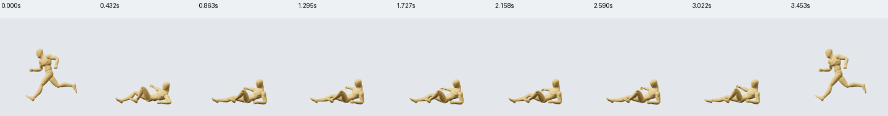

# Locomotion contracts: Slide

The second curated movement family is `locomotion-slide`, using the existing UAL2 Standard CC0 sources. Original motions remain r1 and unchanged. The catalog still contains 43 sources; nine now have detailed semantics, and six source-pinned connection candidates exist across Sword and Slide.

| Movement | Role | Actual behavior |
|---|---|---|
| Slide Start | Primitive | Running stride lowers into a seated slide |
| Slide Loop | Loop | Holds the low seated slide with small body motion |
| Slide Exit | Recovery | Rises from the slide into a running stride |

These are in-place animations. Root displacement is zero in all three. Pelvis travel is measured separately: Start lowers about 0.789 m, Exit rises about 0.789 m, and Loop returns to its initial pelvis position. A game controller must provide directional world travel. Exit does not finish in standing guard, so a prompt requesting a standing finish needs a separate compatible movement.

No stationary foot-contact candidates pass the configured inspection thresholds. Ball-joint heights at the low pose are about 0.10–0.11 m above the floor. The seated pose may involve body/hand support, which the current foot-only contact operation does not validate. No contact approvals or automatic anchors were added. Numerical validity never establishes floor collision, physical balance or naturalness.

## Connections and review evidence

| Contract | Endpoint position / rotation RMS | Reviewed configuration | Decision |
|---|---|---|---|
| `slide-start-to-loop` | 0.00227 m / 2.656° | 0.06 s, 1×→1×, no anchor | Supported under sampled visual and configured numerical review |
| `slide-loop-to-exit` | 0.00227 m / 2.656° | 0.06 s, 1×→1×, no anchor | Supported under sampled visual and configured numerical review |

The links retain candidate status in the immutable catalog. Their separately stored seam policies are reviewed at exact source revisions/hashes and timing. Start/Loop boundary velocity-change RMS values are 0.053/0.156 m/s; Loop/Exit values are 0.067/0.356 m/s. Both windows and the full compiled action have zero configured flags. Thresholds were not changed. Different speeds/blend durations require renewed review before a typed build can use a supported policy.

Nine source frames per camera were inspected in Front/Side, plus exact join start/middle/end frames and whole-action progression. Rendered source/join manifests record source revisions, hashes, cameras and UTC timestamps. The mannequin has no source props. The sampled LLM review is not continuous human review or physical certification.

Evidence is in `authoring/reviews/slide`: `inputs.json`, `source-sheet.png`, `frames/frames.json`, `join-sheet.png`, `joined-frames/frames.json`, `build.json`, `registered.json`, and `run.json`.

## Studio action and LLM workflow

**Slide · Enter → Sustain → Exit** (`slide-contract-study`, r2) is a 3.453-second Start→Loop→Exit action with five phases, including two named joins. It appears in Studio Actions; sources remain in the Movements library. The r2 semantic receipt contains both current supported seam policies and no contact intervals. r1 was the initial candidate build; r2 refreshed the receipt after recording reviews and has the exact same motion hash. r1 captures therefore represent identical current motion.



Use `inspect_movement_library` with query `locomotion-slide` to select the three sources and fetch their actual revisions, hashes and current policies. Validate with `build_action_spec` before committing. Example steps at current source r1:

```json
[
  {"movementId":"move-ual2-slide-start","revision":1,"speed":1},
  {"movementId":"move-ual2-slide-loop","revision":1,"speed":1,
   "connection":{"contractId":"slide-start-to-loop","duration":0.06}},
  {"movementId":"move-ual2-slide-exit","revision":1,"speed":1,
   "connection":{"contractId":"slide-loop-to-exit","duration":0.06}}
]
```

Suitable prompt: “From a running stride, enter a low slide, sustain it briefly and rise back into a running stride.” This composition previews poses in place. It does not yet implement gameplay travel, input controls or collision. The semantic compiler currently uses whole movement clips and a four-second action limit. A shorter loop needs a separate reviewed adapted movement; arbitrary trimming or repeating loops is not exposed by these two contracts.

The shared CLI/MCP tools and existing skills perform discovery, build and review. Studio stores the library, recipes, evidence and run logs. No new transport or tool was added. Initial compile/save took 2.85 s client time. The full family preparation/review run took 13 min 44 s, with 6.65 s recorded service execution; that includes contract curation, source review, service reload and visual inspection, not merely action creation. It is not comparable to a warm prompt-only benchmark. The saved action receipt keeps whole-action visual review pending; sampled review is recorded in the run log.

## Validation and next boundary

Nine contract/review tests pass, plus the focused MCP initialization and live revision roundtrip test. Both updated skills validate and the authoring build passes. Contract tests cover semantic discovery, whole-clip compilation, wrong-pair rejection, edited source-hash rejection and the absence of fabricated contacts. Existing review tests check exact timing enforcement and stale pins. Source replacements in tests follow the service's immutable action-object convention, so the motion-hash cache invalidates correctly.

Next useful work is game-controller travel and a compatible exit-to-locomotion/standing source. Body/hand contact inspection is a separate capability gap; foot anchoring cannot substitute for it. Generic run/start/stop clips are not supplied by the current Standard subset and require source discovery before additional contracts are curated.
