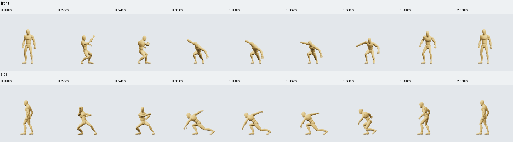

# Regular Sword contract pilot

The six Regular Sword movements now have deterministic measurements and sampled Front/Side visual review. All four curated joins have explicit policy decisions. This completes the bounded review pilot; two joins still need work, and physical balance/contact, weapon collision and continuous human visual approval remain unverified.

## Source contacts

| Source | Recorded intervals in source seconds | Decision |
|---|---|---|
| A | No stationary candidates at configured thresholds | Uncovered time unknown |
| A Recovery | Both feet 0.750–0.9667 | Supported |
| B | No stationary candidates | Uncovered time unknown |
| B Recovery | No stationary candidates | Uncovered time unknown |
| C | Left 1.050–1.1667 | Uncertain |
| C | Left 1.5833–1.6833; right 1.450–1.6833 | Supported |
| Combo | Left 1.7167–2.0833 | Uncertain |
| Combo | Left 2.4833–2.6167 and 2.850–3.000; right 2.350–2.600 and 2.850–3.000 | Supported |

Eight supported and two uncertain foot intervals are saved across three source records. “Supported” means visually near ground in sampled frames and within the stored height/speed/drift bounds. It does not enable anchoring or establish physical support. The two braced left-foot candidates remain uncertain: elevated ball-joint pivots and a flat render do not establish true contact. Absence of a stationary candidate does not mean a foot never touches the ground. All unrecorded time stays unknown.

Source images: `authoring/reviews/sword-completion/source-*.png`, seven frames per camera per source. Every candidate was inspected at start/middle/end in both cameras using `all-contact-candidates.png`. Capture manifests pin exact motion hashes and revisions; current sources are r1. No source motion was revised.

## Join timing comparison

The production `pose-blend-v1` compiler generated 20 transient pair actions at 1× source speeds and no anchor. Each used the actual normalized rig and 60 Hz inspector. These transient actions were not saved to Studio. Report: `authoring/reviews/sword-completion/timing-sweep.json`.

| Pair | 0.0167 s | 0.0333 s | 0.060 s | 0.120 s | 0.200 s |
|---|---:|---:|---:|---:|---:|
| A→B | 2.382 / 2 flags | 0.902 / 0 | 0.617 / 0 | 1.002 / 1 | 1.115 / 1 |
| B→C | 3.028 / 2 | 1.679 / 2 | 1.169 / 1 | 1.091 / 1 | 1.099 / 1 |
| A→A Rec | 1.009 / 1 | 1.009 / 1 | 1.009 / 1 | 1.009 / 1 | 1.009 / 1 |
| B→B Rec | 0.244 / 0 | 0.244 / 0 | 0.244 / 0 | 0.244 / 0 | 0.244 / 0 |

Each cell is the maximum of the two boundary joint-velocity-change RMS values in m/s, followed by configured flag count. These are finite-difference measurements, sensitive to source curves, baking and sampling; they are not a universal naturalness score. Thresholds were not loosened. A longer blend does not necessarily improve continuity.

A separate full-chain comparison was saved as **Sword · Shorter first join**, using A→B 0.06 s and B→C 0.12 s. Its first join falls below thresholds; the second remains flagged. Source progression was compared with the authored Combo through the Front/Side sheets. The whole Combo has no internal timeline seams, so zero seam flags cannot be treated as proof that its motion is superior.

| Current policy | Configuration at 1×→1×, no anchor | Decision |
|---|---|---|
| A→B | 0.06 s | Supported by sampled visual and configured numerical review |
| B→C | 0.12 s | Needs review; flag persists across all tested durations |
| A→A Rec | 0.12 s | Needs review; outgoing RMS change about 1.009 m/s |
| B→B Rec | 0.12 s | Supported by sampled visual and configured numerical review |

Exact join start/middle/end poses were inspected in both cameras. The older A→B 0.12 s needs-review policy remains in history; new typed builds must use the current supported 0.06 s timing or obtain a new review. Existing baked actions and their historical receipts stay unchanged. Source or speed changes require renewed review. The reviewed source Combo remains preferable for a full three-attack sequence when it matches the prompt.

## Complete prompt-to-action test

Test prompt: **“Perform two linked sword attacks, then smoothly recover to standing.”**

Created **Sword · Two attacks → Recover** (`sword-two-hit-recover`, r1), a 2.18-second A→B→B Rec action. It uses both current supported configurations, actual source revisions/hashes and a semantic build receipt. There was one committed build, no source preparation, no joint-angle edits and no timing retries. Full-action inspection reports zero configured flags. Nine progression frames in both cameras show two attack gestures followed by recovery to the source standing stance; exact source/configuration seam evidence was inspected separately. Browser replay progressed to its standing finish. Sword props are absent on the mannequin.



| Recorded stage | Time |
|---|---:|
| Automated selection, validation, build, inspection and preview | 4.46 s |
| Compile and save operation, included above | 4.27 s |
| Capture 30 Front/Side frames | 5.38 s |
| Complete tracked run, including LLM/tool round trips and sampled visual review | 178.99 s (2 min 59 s) |
| Recorded service execution across the run | 4.33 s |

These are one local warm-service run, not a controlled comparison with earlier prompts or a claim that all actions take three minutes. The tool logger counts seven automatic service events; tracking calls and standalone rendering are separate. The run begins before source selection and ends after visual notes are stored. Prior Sword library review took 9 min 14 s and is a separate preparation run, not hidden inside this action benchmark. Current action receipt still says visual review pending: the sampled review is in the run log rather than a full-action approval API.

Reports and logs: `authoring/reviews/sword-completion/{registered.json,review-run.json,prompt-test.json}`. Studio manages the saved motions, evidence and run logs; CLI uses the shared service operations and the action-composition skill directs selection and review. MCP remains available. Compile/persist dominates the automated stage, while LLM/inspection orchestration dominates total elapsed time.

## Next work

Expand to a locomotion family only after checking what source clips actually exist. The UAL2 Standard catalog here includes slide Start/Loop/Exit and several specialized walk loops; it does not currently supply a generic run/start/stop set. Start with a bounded existing family, or obtain an appropriate source set through movement-building. Do not invent transitions or semantics from clip names alone.

For unresolved Sword joins, the next experiment should compare source velocities and bridging/overlap options with the authored sequence. The present compiler blends endpoint poses with an inserted phase; it does not preserve source velocity tangents or overlap motion. Further duration sweeps alone are unlikely to resolve the two consistently flagged pairs.

Reproduce the transient sweep with:

```sh
node_modules/.bin/esbuild authoring/reviews/sword-completion/sweep.ts --bundle --platform=node --format=esm --packages=external --outfile=authoring/reviews/sword-completion/sweep.engine.mjs
node authoring/reviews/sword-completion/sweep.engine.mjs
```

The retained `inputs.json` is revision/hash-pinned historical source data, so this reproduces that recorded experiment. Refresh data and visually inspect new captures before re-registering reviews. Preparation and registration scripts write comparison actions/review revisions and must not be replayed blindly; they are pilot scripts, not an automatic approval workflow.
