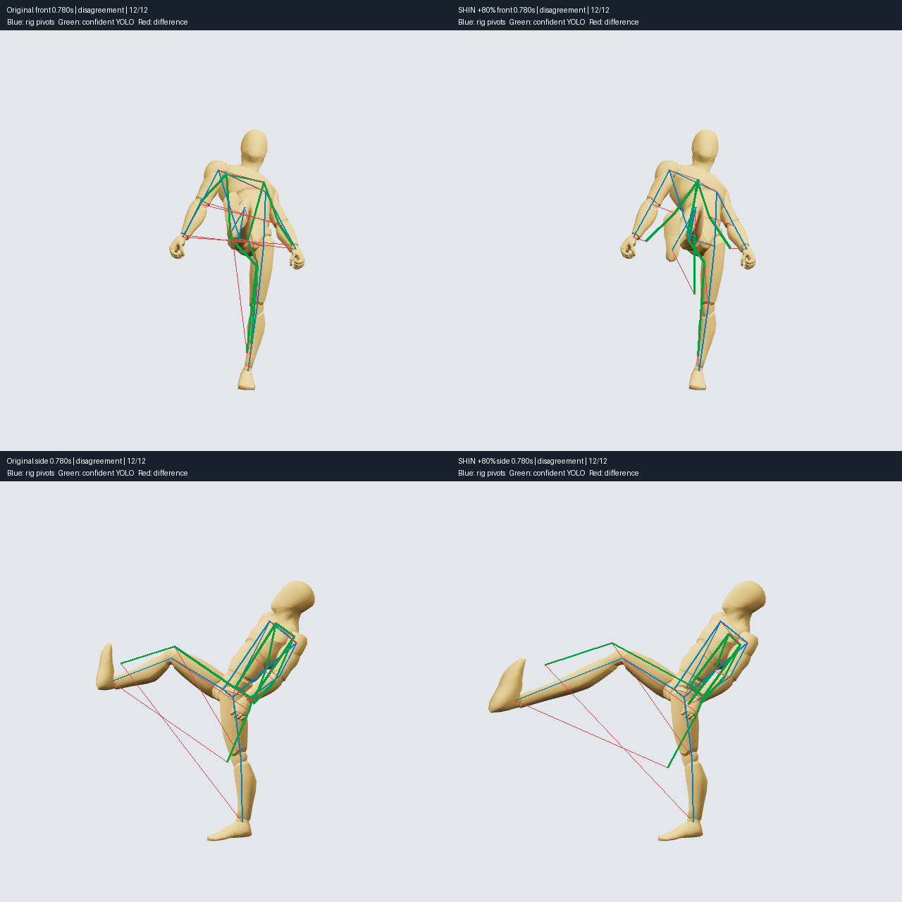

# Rendered-action pose check

2026-10-04. Implemented and ran a bounded YOLO26-pose experiment. The current result supports **optional visual review**, not replacing the existing 3D common-motion matcher or automatically approving natural motion.

## What runs

`authoring/vision/capture.mjs` fetches read-only copies of `kick-study`, `sword-source-study` and `sword-joined-study` from Studio. It uses the existing CharacterPlayer and character GLB in a temporary headless Chrome renderer. It captures 34 original frames at selected times, in front and side views, plus two transient flawed-kick controls. Saved actions, movements and the user's viewer are unchanged.

Each 640×640 PNG has a corresponding record in `authoring/vision/results/frames.json`: action revision/hash, sample time, camera, 12 projected rig landmarks, world positions, control measurements and stage timings. This pilot samples frames directly; it does not encode/decode a video or check every animation frame. Rendering uses software WebGL, not the viewer's WebGPU performance path.

`authoring/vision/check_pose.py` runs official `yolo26n-pose.pt` locally, CPU only, two threads. It selects the person detection by overlap with the projected body. It compares COCO body indices 5–16 with shoulder/elbow/wrist/hip/knee/ankle rig pivots, keeps confidence ≥0.5, and writes JSON plus annotated PNGs. Facial landmarks are omitted because the mannequin has no anatomical face. Side-view occlusion has no visibility ground truth. Bone pivots also differ from the surface landmarks the detector learned.

The experimental agreement label requires at least six eligible landmarks and median pixel error ≤8% of projected body height. This threshold is exploratory, not calibrated. Low coverage produces `inconclusive`. Left/right labels are never silently exchanged to improve the score. An agreement label means only this image-to-projection threshold passed.

## Measured result

Evidence: `authoring/vision/results/pose-report.json`, `frames.json`, and `kick-control-comparison.png`. The first run is retained separately in `pose-report-first-run.json` and `frames-first-run.json`. This is one repeat measurement, not a statistically established benchmark.

| Repeat stage | Elapsed |
| --- | ---: |
| Read Studio action copies | 168 ms |
| Bundle renderer/read asset | 112 ms |
| Launch Chrome/load scene and rig | 3,585 ms |
| Sample/render/synchronize 36 frames | 44 ms |
| Encode PNGs | 885 ms |
| Write PNGs | 23 ms |
| Capture wall time, including other overhead | **5,068 ms** |
| Python dependency imports | 1,511 ms |
| Load cached model | 71 ms |
| First prediction/warmup | 1,368 ms |
| 36 subsequent predictions, including image read/pre/post processing | 2,385 ms |
| Annotate/write results images | 395 ms |
| Python process measured wall time | **5,781 ms** |

Combined measured capture/check is approximately **10.85 s**, excluding shell launch and environment installation. Mean repeated prediction was **66.24 ms/frame**; the reported neural inference stage alone averaged **61.89 ms/frame**. First-run model load/download was 2.74 s and first prediction/warmup 9.11 s, demonstrating why startup must be separated from repeated inference. First-run Python import time was not instrumented, so its complete process time is unknown.

All 36 frames had one person detection. Between 10 and 12 of the 12 mapped landmarks passed confidence gating per frame. Of 34 original frames, 30 passed the exploratory agreement threshold and four disagreed. Both flawed controls disagreed, but their scores **do not reliably distinguish the flaw**:

| Kick at 0.78 s | Original median error/body height | Shin +80% median error/body height |
| --- | ---: | ---: |
| Front | 25.6% | 12.7% |
| Side | 15.0% | 15.2% |

Visual inspection of the overlays shows ambiguous left/right limb assignments during the kick, including predictions with high confidence. The distorted front pose scores better than the original. Therefore detection confidence and projection agreement cannot certify anatomy or naturalness. The direct 3D control correctly measures shin length changing from **0.4345 m to 0.7821 m** (1.8×) in both views; that evidence comes from the rig, not YOLO.



## Speed and workflow decision

The existing `find_common_motion` benchmark (`authoring/benchmarks/common-motion.json`) reports cached client times **2.24 ms** and **1.49 ms** per source/Combo pair. It compares 3D motion windows across clips; this experiment compares selected 2D images against projected joints. These are different tasks and sample counts, so there is no direct speed ratio. The measured rendering/inference overhead does not justify replacing direct 3D matching. No video-based common-window search was implemented or benchmarked.

Use structured 3D data for shared-part discovery, source selection, joins and physical checks. The LLM can run this optional capture/check and read the report and flagged images when it needs a second visual signal. Treat disagreement as a request for inspection, not an instruction to regenerate an otherwise good action. These files are local CLI artifacts; no new MCP operation or automatic Studio approval gate was added.

Useful next work is deterministic 3D checks for bone lengths, support-foot drift, contact intervals and seam velocities, followed by visual review of only the affected frames. Reference-video pose extraction remains a separate experiment because it lacks exact rig/camera ground truth. Neither this sparse test nor the current matcher establishes balance, collision safety, naturalness or complete temporal continuity.

## Reproduce

Studio's authoring service must be available on loopback port 5174. From the repository root:

```sh
npm run vision:capture
npm run vision:check
npm run test:vision
```

The capture uses the bundled Playwright package and installed macOS Chrome. Override `PLAYWRIGHT_PACKAGE_JSON` (absolute package.json path), `CHROME_PATH`, or `STUDIO_URL` if needed. Studio URL is restricted to HTTP loopback. An optional first positional capture argument changes the output directory; pass the same directory to the Python checker with `--frames`.

Python is isolated in `.authoring/vision-venv`; no service remains running after the check. To recreate it:

```sh
python3 -m venv .authoring/vision-venv
.authoring/vision-venv/bin/python -m pip install -r authoring/vision/requirements-lock.txt
```

The lock records this macOS arm64/Python 3.12 installation; other platforms may require different PyTorch wheels. Model weights reside in `.authoring/vision-models/yolo26n-pose.pt`; initial creation downloads them from the official Ultralytics release. Reports record package versions, source revisions and model SHA256 (`eb3bb8268828aeaf515cec23a4bfafd793944a86fe9af94ba7823609c14522a9`). The isolated environment occupies about 1.1 GB of disk; the pilot images/reports occupy about 4.6 MB. Unrelated running services were left running.

Four unit tests verify confidence gating, missing detections, overlap-based selection and error reporting. The capture ran successfully twice, all controls measured the intended 1.8× ratio, overlays were visually inspected, and the standalone renderer passes strict TypeScript checking.

Official references: [YOLO pose output and landmark format](https://docs.ultralytics.com/tasks/pose/), [prediction API](https://docs.ultralytics.com/modes/predict/), [YOLO26 model and licensing information](https://docs.ultralytics.com/models/yolo26/), [downloaded weights](https://github.com/ultralytics/assets/releases/download/v8.4.0/yolo26n-pose.pt). Ultralytics uses AGPL-3.0 or Enterprise licensing; this experimental dependency has not been added to the shipped Studio web bundle.
