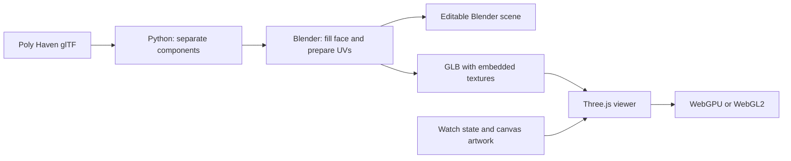

# SECOND demo: 3D model, Blender, and Three.js

Documentation location: `docs/watch/IMPLEMENTATION_SUMMARY.md`. Commands run from the repository root; original component-relative code and asset paths below refer to `watch/`.

SECOND is an interactive digital watch built from an existing 3D asset. Blender prepares the geometry and exports the browser model. Three.js loads that model, renders it, and adds the live face and clickable buttons.

## 1. Starting model

We used [Digital Wrist Watch by Adrian C / Poly Haven](https://polyhaven.com/a/digital_wrist_watch). Its CC0 asset license permits modification and redistribution. We retained the artist credit in the demo.

We downloaded the original Blender source and the 1K glTF package. The glTF package contained geometry, a binary buffer, and three JPEG textures: base color, normal, and combined ambient occlusion/roughness/metalness.

The original watch had separate bracelet sections and a clasp. Its main case contained the face and side-button geometry. The time and labels were fixed artwork in the texture. Making the watch functional required editable parts and a new display surface.

## 2. Separate the interactive parts

[prepare_asset.py](../../watch/prepare_asset.py) reads the glTF geometry directly.

It groups triangles into connected components. It treats vertices at matching positions as connected, including vertices duplicated at texture seams. Bounds identify the face and the three side buttons. Each component becomes a named mesh:

- `custom_face`
- `button_light`
- `button_mode`
- `button_adjust`

The script retains the case, straps, clasp, and original material data. It omits the original glass and lower display plane, which would interfere with the replacement face. It writes an intermediate glTF and checks downloaded files against Poly Haven's published MD5 values.

The position thresholds are specific to this watch. This script is not a general automatic separator for any model.

## 3. Prepare and export in Blender

We ran official portable Blender 4.5.9 LTS in background mode with [prepare_blender.py](../../watch/prepare_blender.py). It imported the separated glTF. The retained original `.blend` was not the input to this preparation script.

The script rebuilt the face as a filled polygon using its outer convex outline. This closed the LCD opening and provided one continuous surface for the new face artwork. It also created planar UV coordinates: these map positions on the watch face to positions in a rectangular texture.

The new face received a plain dark material. The script added source metadata and button action names, then exported only the model meshes to GLB. After export, it added a Blender camera, studio lights, and a `START HERE` text block. Finally, it packed the textures and saved the editable scene.

| Output | Purpose |
| --- | --- |
| [second-watch.blend](../../watch/source/second-watch.blend) | Editable geometry, materials, packed textures, and Blender studio setup. |
| [watch.glb](../../watch/assets/watch.glb) | Self-contained browser asset, approximately 2.17 MB, with embedded textures. |

The exported GLB contains 13 meshes, 10,322 triangles, and three embedded images.

The Blender lights and camera are excluded from GLB. The Blender face is plain dark; the browser supplies its live artwork.

## 4. Load and light the model with Three.js

[main.js](../../watch/main.js) uses Three.js 0.186.1 and `GLTFLoader` to load `watch.glb`.

The scene uses `WebGPURenderer`, with WebGL2 fallback. The model is scaled by 100 and rotated for presentation. A perspective camera and `OrbitControls` provide rotation, zoom, optional automatic rotation, and face/full-watch framing.

`RoomEnvironment` and `PMREMGenerator` produce the reflection environment. Hemisphere and directional lights illuminate the metal body. A shared body material retains the original maps. Steel, gold, and graphite controls tint that material; they do not swap models or create separate texture sets.

## 5. Replace the fixed face with a live texture

Three.js finds `custom_face` by name. The runtime also reconstructs its filled outline and planar UVs, so the browser explicitly controls the display surface.

JavaScript draws the complete face onto a 1024 × 960 canvas: branding, inscription, labels, date, and seven-segment digits. `CanvasTexture` maps that drawing onto the face. A `MeshBasicMaterial` with tone mapping disabled keeps the display colors readable under different lighting.

When the displayed content changes, the canvas is redrawn and `texture.needsUpdate` uploads it. Backlight changes the display palette. Time setting blinks the selected digits. The display is an illustrative LCD effect; it does not simulate physical liquid crystals or light emission.

## 6. Make the side buttons work

Each button's name connects its geometry to a JavaScript action. The runtime moves the button geometry's origin to its center and stores its resting position.

Invisible boxes provide larger click targets around the small buttons. `Raycaster` detects mouse clicks or taps. The code distinguishes a click from an orbit drag and checks whether the body hides the target. A short inward movement gives visible press feedback.

The physical buttons and HTML controls call the same actions in [state.js](../../watch/state.js): light, mode, and adjust. That state drives the clock, setting mode, and stopwatch. Browser storage retains branding, inscription, finish, format, and time offset.

The GLB supplies the shape and materials. JavaScript supplies behavior and animation. No rig or exported button animation was required.

## 7. Pipeline and verification



The saved Blender scene was reopened to verify all three packed textures and button objects. Seven automated checks cover time behavior, stopwatch behavior, source geometry, and the final GLB. Browser checks verified both render backends, physical button clicks, customization, saved preferences, and a narrow phone layout. A physical iPhone run of the new watch demo remains a separate check.

To rebuild from the downloaded source assets, run from the project root:

```sh
python3 watch/prepare_asset.py
blender --background --factory-startup --python watch/prepare_blender.py
npm ci
npm run build
npm test
```

The Blender command requires an available Blender executable. The temporary runtime used during development was unmounted after verification; Blender was not installed system-wide.

The reusable pattern is to prepare named geometry in Blender, export a compact asset, and attach application behavior in Three.js. A changing screen belongs in the runtime, so time and text can update without exporting the model again.
